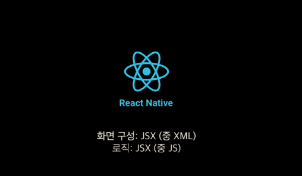

리액트 네이티브 : JSX (Javascript + XML)

## JSX

* Javascript + MXL
* ES6 - 모던한 수준의 자바스크립트, 바벨
* JSX내에 스타일시트를 포함. 웹의 CSS와 많은 개념을 공유하지만, 독자적의 포맷. CSS파일로 작성 불가

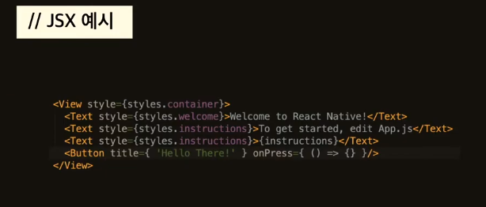

* xml은 의미있는 태그를 내가 스스로 정의해서, 규칙을 정한다. 

* 태그에 대한 스타일설정 등 모든 설정을 해준다. 

* 문자열만 할당할 수 있었는데, JSX는 배열이라던지 다양한 오브젝트를 넣을 수 있다. 따옴표 외에 중괄호로 감싸면 된다. 

* 중괄호가 등장 -> 자바스크립트 내용을 담는다고 생각하면 된다.

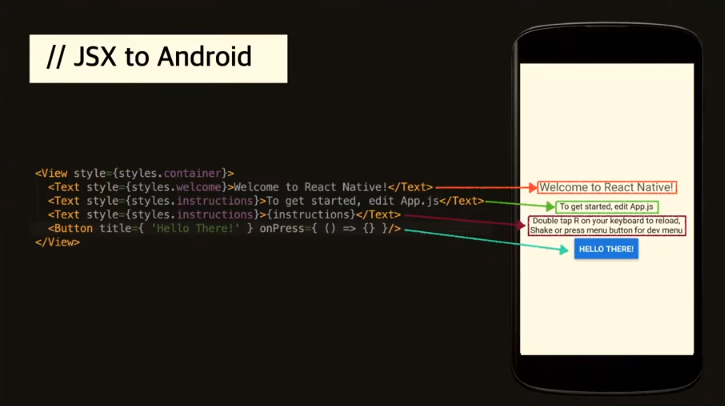

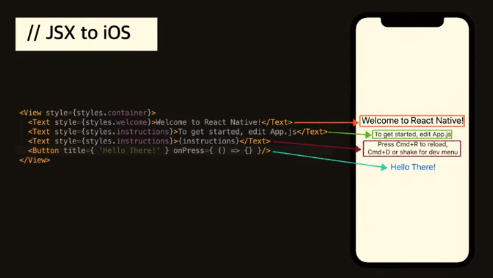

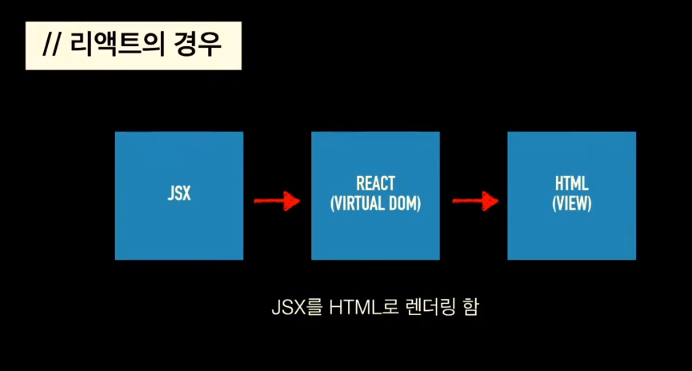

버츄얼 돔으로 렌더링을 했었다. JSX는 설계도에 대한 부분이고, JSX에서 설계한 부분을 변환을 해서 최종적으로 HTML로 만들어 주는 형태

그렇다면,HTML 말고도 다른걸로도 변환할 수 있지 않을까? 해서 나온게 리액트 네이티브!

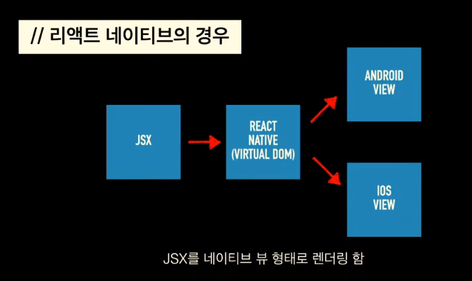

어쨌든 버츄얼 돔의 형태를 만들어서 다른 형태로 렌더링 하는것에서 공통점이 있다. 

여러가지 환경으로 렌더링 하는것이 리액트 기술

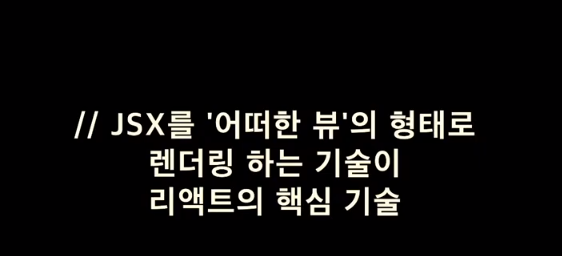

리액트 네이티브는 그 중 aos, ios 로 맞춘다. 

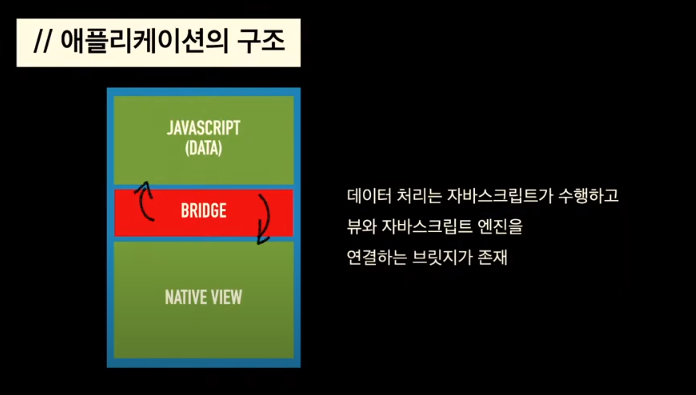

* 브릿지

  자바스크립트 엔진이 버츄얼 돔을 만들면, "브릿지"가 버츄얼 돔에 맞게끔 네이티브 뷰를 계속 업데이트 시키고 사용자가 네이티브뷰에 인터랙션을 했을때 자바스크립트 엔진에 전달해준다. 

리액트네이티브의 핵심은 브릿지!

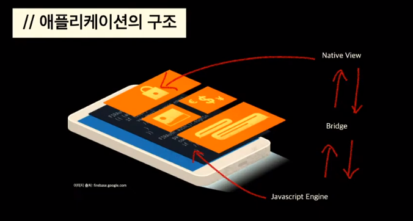

* 지도 

실시간 지도렌더링 -> 지도 : 리액트 네이티브 맵스 라이브러리 많이 사용

지도파트는 네이티브로 동작을 하고, 그 위에 리액트네이티브 뷰가 얹어지는 형태

지도는 네이티브로 돌리고 UI는 리액트네이티브뷰로 돌린다.

구글 맵 기준으로 동작함

리액트네이티브 -> 카카오맵, 네이버맵 sdk 이용시 지도는 리액트로 출력하고 ui같은 나머지 부분은 리액트네이티브로 구현한다. 

리액트네이티브는 네이티브랑 연동되는 부분이 아주 많다. 

* 카메라 

  카메라는 네이티브에서 동작을 하게 되는 것이고, 하이브리드 웹뷰는 별도의 레이어로, 레이어가 다른 층에서 동작. 투명한 웹뷰로 만들어서 UI튜닝 등등

  리액트네이티브에서는 네이티브 모듈을 굉장히 활용을 많이 하는 편 

리액트 네이티브로 리액트를 시작해도 된다. 애플리케이션의 라이프사이클이 좀 다르다.

node 모듈들을 쓰기 때문에 package.json이 있음

### StyleSheet

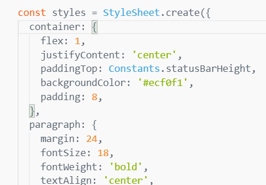

expo에서 스타일 시트는, 안드로이드 화면의 맨 위 (status bar) 까지 적용이 되기 때문에, 그 만큼 패딩을 주는 것이 좋다. 

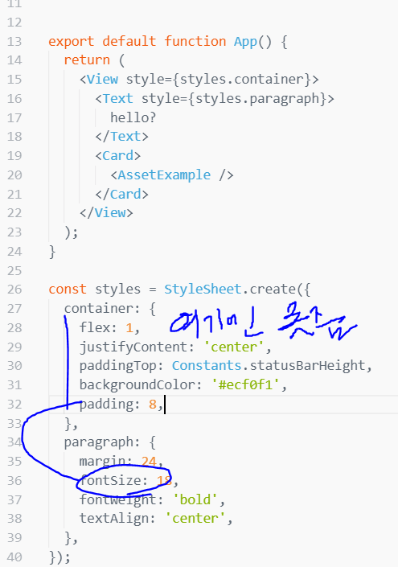

fontSize같은거는 font에만 줄 수 있다. 안그러면 오류난다.

또 부모 특성을 상속받지 않으므로 학습 필요

리액트에서는 모든 요소를 flex레이아웃으로 관리

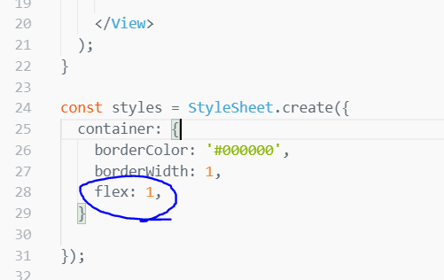

이렇게 해주면 height: '100%' 와 같은 효과를 낸다. 

flex: 1 은 flex-grow: 1 이다. (축약속성)

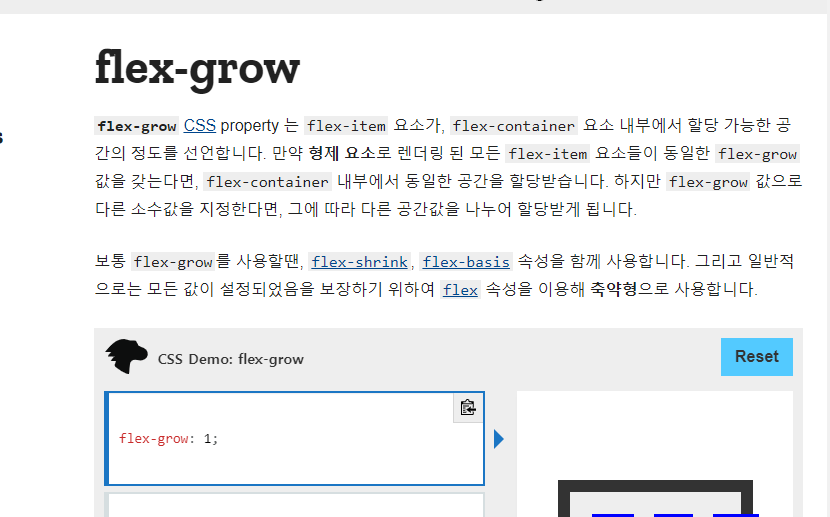

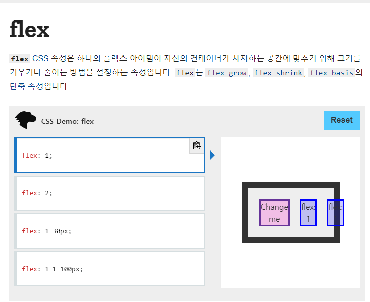

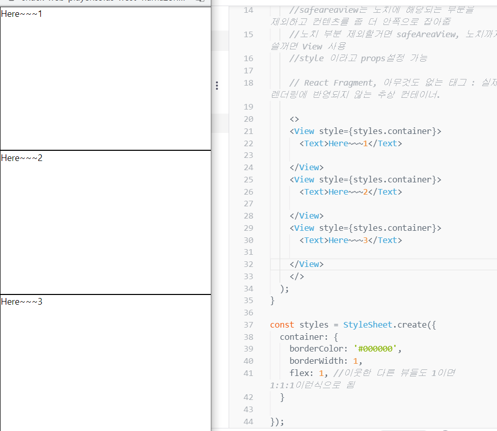

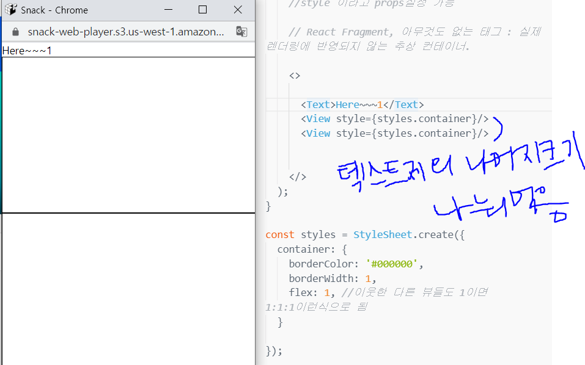

패딩 줘야 상태바에 안가려짐 